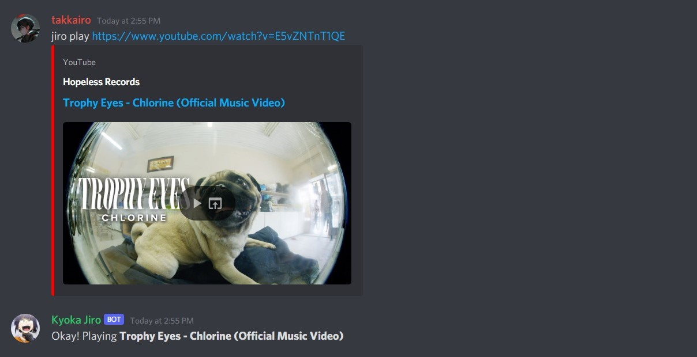
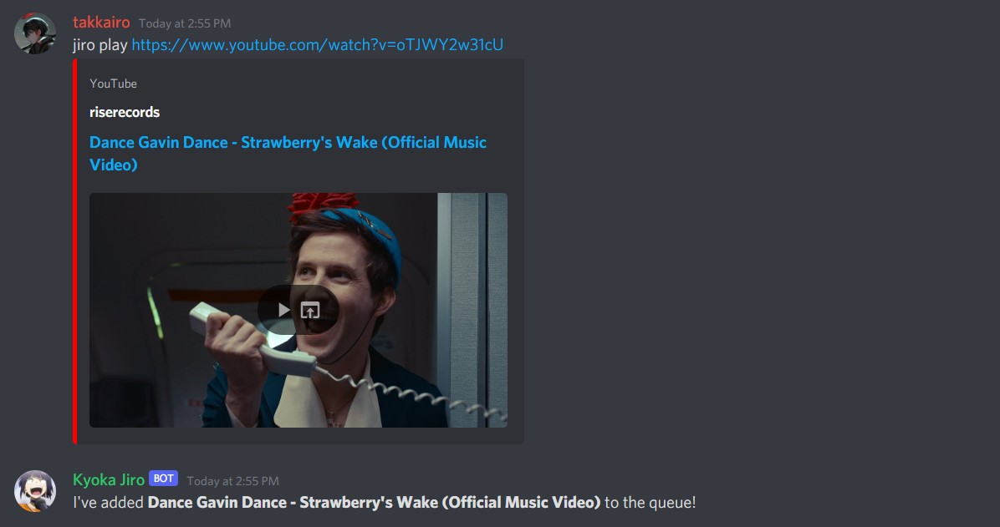

# Kyoka Jiro Discord Bot 🎧🎶

A simple music bot for Discord. Made with discord.js.

[Kyoka Jiro](https://myheroacademia.fandom.com/wiki/Kyoka_Jiro) is a character from the anime [My Hero Academia](https://en.wikipedia.org/wiki/My_Hero_Academia).

## Installation

```powershell
# Clone the main repository, and then run:
$ npm install

# Create a .env file in the root directory and add in your bot's token:
TOKEN='dASid123ASDJHsashjsS123SbsjdS'

# Download FFMPEG and put ffmpeg.exe and put it in the project's root directory:
https://www.ffmpeg.org/download.html

# Start the bot!
$ node index.js
```

## Usage

### Playing Songs

You can simply tell Jiro to play songs by sending `jiro play` followed by a YouTube video URL.



### Queuing Songs

If a song is currently playing, sending `jiro play` followed by a YouTube URL will add that song to the queue.



### Skipping Songs

Simply send `jiro skip` to skip to the next song in the queue.


### Stopping

You can simply stop Jiro from playing by sending `jiro stop`.

## License

MIT License

Copyright (c) 2021 Red Oral

Permission is hereby granted, free of charge, to any person obtaining a copy
of this software and associated documentation files (the "Software"), to deal
in the Software without restriction, including without limitation the rights
to use, copy, modify, merge, publish, distribute, sublicense, and/or sell
copies of the Software, and to permit persons to whom the Software is
furnished to do so, subject to the following conditions:

The above copyright notice and this permission notice shall be included in all
copies or substantial portions of the Software.

THE SOFTWARE IS PROVIDED "AS IS", WITHOUT WARRANTY OF ANY KIND, EXPRESS OR
IMPLIED, INCLUDING BUT NOT LIMITED TO THE WARRANTIES OF MERCHANTABILITY,
FITNESS FOR A PARTICULAR PURPOSE AND NONINFRINGEMENT. IN NO EVENT SHALL THE
AUTHORS OR COPYRIGHT HOLDERS BE LIABLE FOR ANY CLAIM, DAMAGES OR OTHER
LIABILITY, WHETHER IN AN ACTION OF CONTRACT, TORT OR OTHERWISE, ARISING FROM,
OUT OF OR IN CONNECTION WITH THE SOFTWARE OR THE USE OR OTHER DEALINGS IN THE
SOFTWARE.
